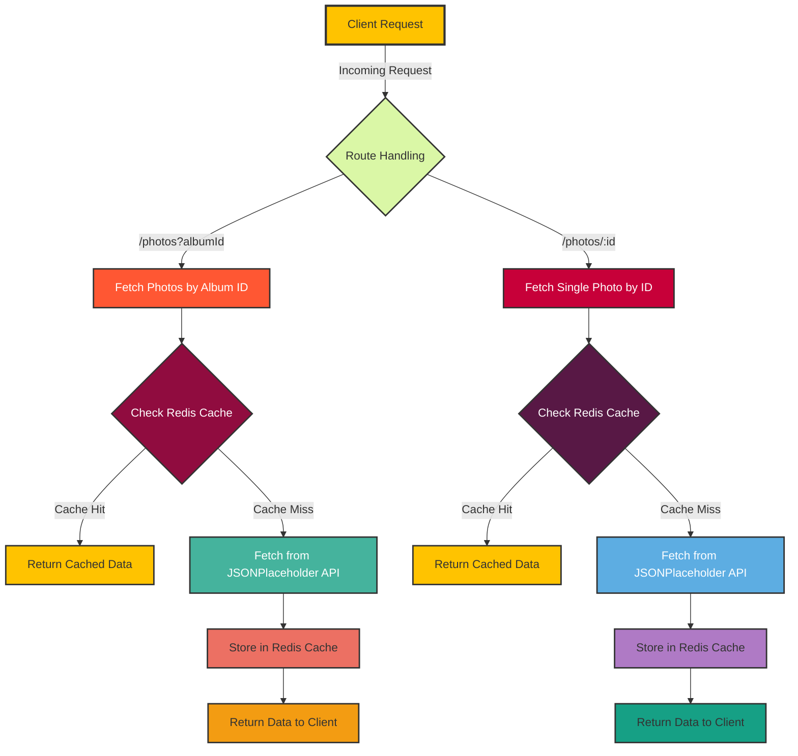

# Express Redis Caching Project 🚀🔬

## Overview
This project is a Node.js Express server that implements Redis caching to optimize API data retrieval from JSONPlaceholder. By leveraging Redis, we significantly improve response times and reduce external API calls.
## 🏗️ System Architecture

### Mermaid Diagram


### Architecture Explanation
The system architecture demonstrates a sophisticated caching mechanism:
1. Client sends a request to specific endpoints
2. Routes are processed through a caching check
3. Redis cache is consulted first
4. On cache miss, data is fetched from JSONPlaceholder API
5. Fresh data is stored in Redis for future requests
   
## 🌟 Features
- **Efficient Caching**: Intelligent Redis caching mechanism
- **Flexible Routing**: Handle photo retrieval by album or individual ID
- **Performance Optimization**: Reduce redundant API calls
- **Error Handling**: Robust error management
- **CORS Support**: Cross-Origin Resource Sharing enabled

## 🛠 Technologies Used
- Node.js
- Express.js
- Redis
- Axios
- CORS

## 📋 Prerequisites
Before you begin, ensure you have the following installed:
- Node.js (v14 or later)
- Redis server
- npm (Node Package Manager)

## 🔧 Installation

### 1. Clone the Repository
```bash
git clone https://github.com/YOUR_USERNAME/express-redis-caching.git
cd express-redis-caching
```

### 2. Install Dependencies
```bash
npm install
```

### 3. Start Redis
Ensure your Redis server is running. Default configuration:
- Host: localhost
- Port: 6379

### 4. Run the Application
```bash
# Start the server
npm start

# Development mode with nodemon
npm run dev
```

## 🌐 API Endpoints

### 1. Get Photos by Album ID
- **Endpoint**: `/photos`
- **Method**: GET
- **Query Parameter**: `albumId`
- **Example**: `http://localhost:3000/photos?albumId=1`

### 2. Get Single Photo by ID
- **Endpoint**: `/photos/:id`
- **Method**: GET
- **Example**: `http://localhost:3000/photos/1`

## 🔍 Caching Strategy
- Default cache expiration: 1 hour (3600 seconds)
- Cache checks before making external API calls
- Automatic cache population on cache miss

## 📊 Performance Benefits
- Reduced latency
- Decreased external API calls
- Improved application responsiveness

## 🚨 Error Handling
- Comprehensive error logging
- 500 status code for server errors
- Graceful error responses

## 🔒 Security Considerations
- CORS enabled for flexible cross-origin requests
- No sensitive data exposure
- Secure Redis connection

## 🔜 Future Improvements
- Add more comprehensive logging
- Implement cache invalidation strategies
- Add authentication
- Create more granular caching controls

## 💡 Contributing
1. Fork the repository
2. Create your feature branch (`git checkout -b feature/AmazingFeature`)
3. Commit your changes (`git commit -m 'Add some AmazingFeature'`)
4. Push to the branch (`git push origin feature/AmazingFeature`)
5. Open a Pull Request

## 📜 License
Distributed under the MIT License. See `LICENSE` for more information.


Project Link: [https://github.com/rajandass/express-redis-caching](https://github.com/rajandass/express-redis-caching)

---

### 💖 Support
If you find this project helpful, please consider starring the repository! 

**Happy Coding!** 👨‍💻🎉
